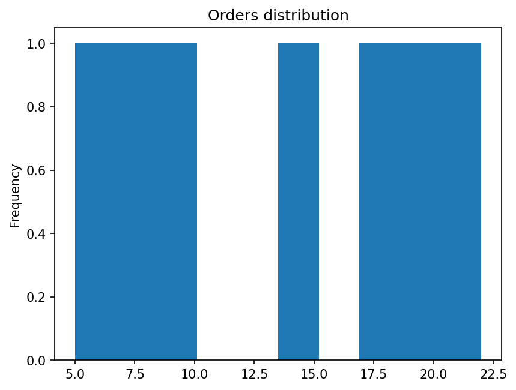
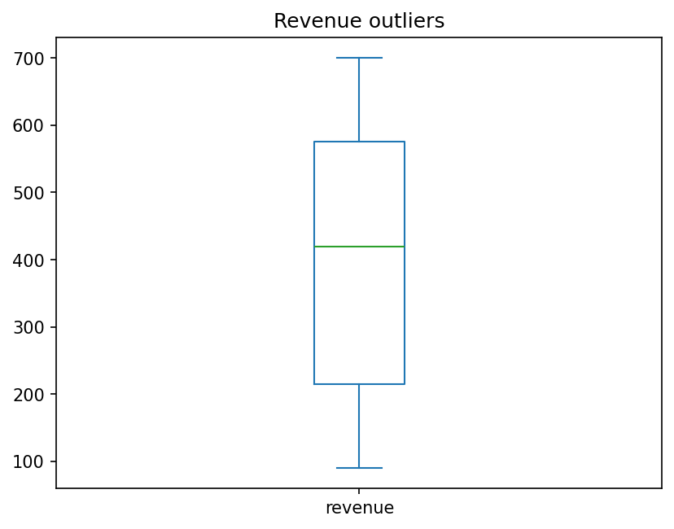
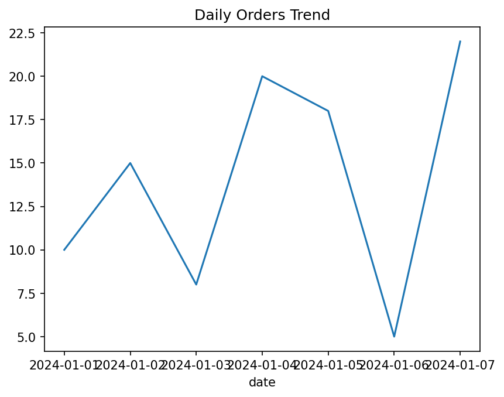

## ETL Data Validation Pipeline (Python)

### Objective
Build a simple ETL pipeline that extracts raw CSV data, validates quality,
cleans/transforms it, saves a cleaned dataset, and performs visual checks to
detect anomalies (distribution shifts, outliers, trend gaps).

### Tech Stack
- Python
- Pandas
- Matplotlib
- JupyterLab

### Project Structure
- `data/` raw and cleaned datasets
- `src/` pipeline scripts (extract, validate, transform, load)
- `outputs/plots/` saved validation plots
- `notebooks/` exploratory validation notebook

### Sample Outputs





### How to Run
```bash
python -m venv .venv
source .venv/bin/activate
pip install -r requirements.txt
python src/run_etl.py
